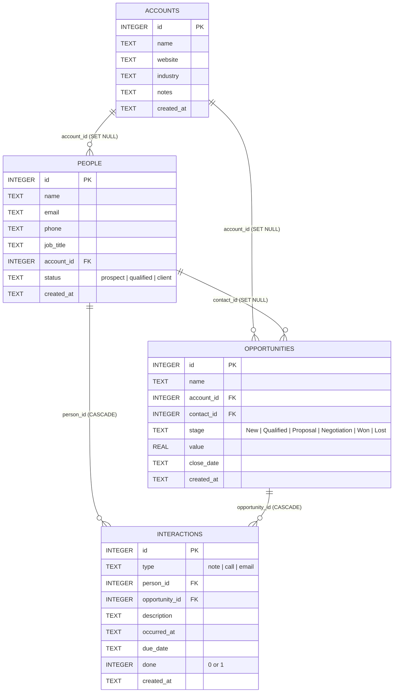

# DealFlow CRM — Agent Specification & Guidelines

This document defines the system specification, architectural rules, data model contracts, visual design requirements, build phases, and validation standards for **DealFlow CRM**. Any AI agent operating in this repository must strictly adhere to these specifications.

---

## 1. Project Overview & Philosophy

**DealFlow CRM** is a single-user, self-hosted personal relationship management and sales pipeline system running locally on the user's computer. It is designed as a streamlined, lightweight alternative to complex enterprise cloud CRMs (such as Salesforce or HubSpot).

### Core Principles
1. **100% Local & Self-Contained**: No user authentication, no multi-tenancy, no cloud services, no telemetry, and no external internet dependencies.
2. **Single-Command Execution**: The application must build, seed, test, and start via standard `npm` commands (`npm run dev`, `npm test`).
3. **On-Disk SQLite Storage**: All domain entities are stored in a local SQLite file (`crm.db`) with relational integrity and automatic startup seeding.
4. **Standard Ecosystem Libraries**: Leverage battle-tested libraries for core UI behaviors:
   - `@dnd-kit` for drag-and-drop Kanban operations.
   - `@tanstack/react-table` for data grid rendering and filtering.
   - `recharts` for monthly sales metrics visualization.
   - `lucide-react` for iconography.
   - `better-sqlite3` for synchronous, zero-latency local database persistence.

---

## 2. System Architecture

The project is structured as a single-page TypeScript application backed by a lightweight Express REST API that communicates with SQLite:

```text
┌────────────────────────────────────────────────────────┐
│                   React 18 Frontend                    │
│   (Vite + React Router DOM + TanStack Table + Recharts) │
└───────────────────────────┬────────────────────────────┘
                            │ Proxy: /api/* (Port 5173 -> 3001)
┌───────────────────────────▼────────────────────────────┐
│                  Express REST API Server               │
│         (Node.js + TSX + better-sqlite3 Driver)        │
└───────────────────────────┬────────────────────────────┘
                            │ SQL Queries & Migrations
┌───────────────────────────▼────────────────────────────┐
│                   SQLite Database                      │
│                  File: ./crm.db                        │
└────────────────────────────────────────────────────────┘
```

---

## 3. Data Model & Database Schema

The database uses SQLite with Write-Ahead Logging (`WAL` mode) and enforced Foreign Keys (`PRAGMA foreign_keys = ON`).

### Entity Relationship Diagram



### Table Definitions & Constraints

```sql
CREATE TABLE IF NOT EXISTS accounts (
  id          INTEGER PRIMARY KEY AUTOINCREMENT,
  name        TEXT NOT NULL,
  website     TEXT,
  industry    TEXT,
  notes       TEXT,
  created_at  TEXT NOT NULL DEFAULT (datetime('now'))
);

CREATE TABLE IF NOT EXISTS people (
  id          INTEGER PRIMARY KEY AUTOINCREMENT,
  name        TEXT NOT NULL,
  email       TEXT,
  phone       TEXT,
  job_title   TEXT,
  account_id  INTEGER REFERENCES accounts(id) ON DELETE SET NULL,
  status      TEXT NOT NULL DEFAULT 'prospect' CHECK(status IN ('prospect','qualified','client')),
  created_at  TEXT NOT NULL DEFAULT (datetime('now'))
);

CREATE TABLE IF NOT EXISTS opportunities (
  id           INTEGER PRIMARY KEY AUTOINCREMENT,
  name         TEXT NOT NULL,
  account_id   INTEGER REFERENCES accounts(id) ON DELETE SET NULL,
  contact_id   INTEGER REFERENCES people(id) ON DELETE SET NULL,
  stage        TEXT NOT NULL DEFAULT 'New' CHECK(stage IN ('New','Qualified','Proposal','Negotiation','Won','Lost')),
  value        REAL NOT NULL DEFAULT 0,
  close_date   TEXT,
  created_at   TEXT NOT NULL DEFAULT (datetime('now'))
);

CREATE TABLE IF NOT EXISTS interactions (
  id              INTEGER PRIMARY KEY AUTOINCREMENT,
  type            TEXT NOT NULL CHECK(type IN ('note','call','email')),
  person_id       INTEGER REFERENCES people(id) ON DELETE CASCADE,
  opportunity_id  INTEGER REFERENCES opportunities(id) ON DELETE CASCADE,
  description     TEXT NOT NULL,
  occurred_at     TEXT NOT NULL DEFAULT (datetime('now')),
  due_date        TEXT,
  done            INTEGER NOT NULL DEFAULT 0,
  created_at      TEXT NOT NULL DEFAULT (datetime('now'))
);
```

---

## 4. API Endpoints Contract

All API endpoints are prefixed with `/api` and return standard JSON responses.

### Accounts (`/api/accounts`)
- `GET /api/accounts?q={search}`: List accounts with optional fuzzy name/industry search.
- `GET /api/accounts/:id`: Account detail with linked `people` and `opportunities`.
- `POST /api/accounts`: Create account (`name`, `website`, `industry`, `notes`).
- `PUT /api/accounts/:id`: Update account attributes.
- `DELETE /api/accounts/:id`: Remove account (sets foreign keys in child records to `NULL`).

### People (`/api/people`)
- `GET /api/people?q={search}&status={prospect|qualified|client}`: List people with search & filter.
- `GET /api/people/:id`: Person detail with linked `account_name` and full `interactions` history.
- `POST /api/people`: Create person (`name`, `email`, `phone`, `job_title`, `account_id`, `status`).
- `PUT /api/people/:id`: Update person record.
- `DELETE /api/people/:id`: Delete person (cascades interactions).

### Opportunities (`/api/opportunities`)
- `GET /api/opportunities?q={search}&stage={stage}`: List opportunities with account and contact joins.
- `GET /api/opportunities/:id`: Opportunity detail with linked interactions.
- `GET /api/opportunities/stats/won-by-month`: Monthly aggregate of won deals count & total revenue.
- `POST /api/opportunities`: Create opportunity (`name`, `account_id`, `contact_id`, `stage`, `value`, `close_date`).
- `PUT /api/opportunities/:id`: Update opportunity details.
- `PATCH /api/opportunities/:id/stage`: Update pipeline stage (used by drag-and-drop Kanban board).
- `DELETE /api/opportunities/:id`: Delete opportunity.

### Interactions & Tasks (`/api/interactions`)
- `GET /api/interactions?person_id={id}&opportunity_id={id}`: List interactions for specific records.
- `GET /api/interactions/recent`: Top 10 most recent interactions across all entities.
- `GET /api/interactions/tasks?done={true|false}`: Filterable list of follow-up tasks with due dates.
- `POST /api/interactions`: Create interaction (`type`, `person_id`, `opportunity_id`, `description`, `occurred_at`, `due_date`, `done`).
- `PUT /api/interactions/:id`: Edit interaction record.
- `PATCH /api/interactions/:id/done`: Toggle task completion state (`{ done: boolean }`).
- `DELETE /api/interactions/:id`: Remove interaction.

---

## 5. Application Sections & UI Requirements

1. **Home (`/`)**:
   - Monthly Won Deals bar chart & Revenue trend line chart.
   - Live feed of recent interactions across all entities (sorted newest-first).
   - Task list with actionable checkboxes partitioned into upcoming and overdue tasks.
2. **Accounts (`/accounts`, `/accounts/:id`)**:
   - Filterable, searchable table displaying company name, website, industry, and note previews.
   - Detail view showing full metadata, linked staff/people, and active deal summaries.
3. **People (`/people`, `/people/:id`)**:
   - Searchable by name, email, or company. Status quick-filter tabs (`All`, `Prospect`, `Qualified`, `Client`).
   - Detail view with company linkage and chronological interaction timeline.
4. **Opportunities (`/opportunities`, `/opportunities/:id`)**:
   - Data table with deal name, linked account, primary contact, stage badge, formatted value ($ USD), and target close date.
5. **Board (`/board`)**:
   - Kanban board with 6 columns: `New` → `Qualified` → `Proposal` → `Negotiation` → `Won` → `Lost`.
   - Card displays deal title, company, primary contact, and monetary value.
   - Real-time drag-and-drop card movements with persistent database stage updates.

---

## 6. Visual Design Guidelines & Prohibitions

### Approved Color Palette
- **Primary Brand Colors**:
  - Amber: `#ecad0a` (Accent, highlighted milestones)
  - Blue: `#209dd7` (Active states, secondary badges, interactive links)
  - Purple: `#753991` (Highlights, icons, specialized tags)
- **Neutrals**:
  - Backgrounds: `#0f172a`, `#1e293b`, `#f8fafc`, `#ffffff`
  - Borders: `#e2e8f0`, `#cbd5e1`, `#334155`
  - Text: `#0f172a`, `#334155`, `#64748b`

### Strict Design Prohibitions (Zero AI Clichés)
- ❌ **NO** full-page or multi-color background gradients.
- ❌ **NO** purple-tinted container backgrounds.
- ❌ **NO** gradient-filled buttons or flashy glows.
- ❌ **NO** cards or panels with a thick single-color accent stripe along one border edge.
- ❌ **NO** placeholder lorem ipsum text; always use realistic business demo data.

---

## 7. Scope Boundaries (Version 1)

Do **NOT** implement the following features in this version:
- No user authentication, sessions, or multi-user access.
- No AI or LLM-driven automated workflows.
- No external email/calendar/telephony integrations (IMAP, SMTP, Twilio, Google Calendar).
- Single currency only ($ USD); no multi-currency conversion.
- No custom pipeline stages (stages are fixed: `New`, `Qualified`, `Proposal`, `Negotiation`, `Won`, `Lost`).
- No pagination or CSV import/export facilities.

---

## 8. Build Phases & Acceptance Criteria

Agents must verify completion of each phase through demonstrable test execution and visual browser confirmation:

### Phase 1 — Foundation & Data Layer
- [x] Express backend + SQLite database initialized with schema.
- [x] Lifelike demo data seeder (10 accounts, 20 people, 20 opportunities, 30 interactions).
- [x] Unit test suite (`tests/crud.test.ts`) covering all 4 record types.

### Phase 2 — Accounts & People
- [x] List, Search, Filter, Create, Edit, and Delete functionality for Accounts and People.
- [x] Relational detail views for linked entities.

### Phase 3 — Opportunities & Board
- [x] Opportunity list and detail views with value, close date, and entity links.
- [x] 6-column Kanban board with `@dnd-kit` drag-and-drop stage updates.

### Phase 4 — Interactions & Tasks
- [x] Activity logging (note, call, email) directly from Person and Opportunity views.
- [x] Chronological timeline (newest-first) and task due date completion toggle (`done: 0/1`).

### Phase 5 — Home Dashboard
- [x] Monthly Won deal counts and revenue metric charts.
- [x] Recent interactions feed and overdue/upcoming task lists with live updates.

### Phase 6 — Verification & Quality Assurance
- [x] All 29 unit tests passing (`npm test`).
- [x] Zero console warnings/errors in the browser.
- [x] Verified full lifecycle in browser: create, search, update, drag card, log interaction, mark task complete.
