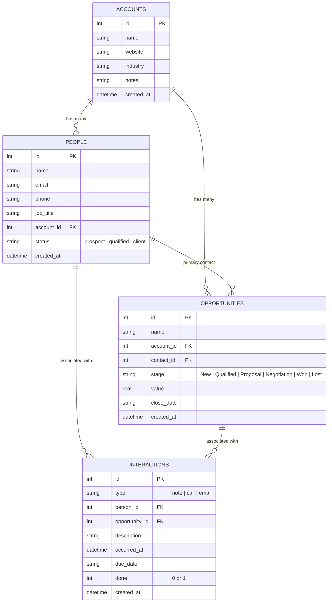

# MyContacts CRM

> A fast, lightweight, and self-hosted personal relationship management tool built with **React**, **TypeScript**, **Express**, and **SQLite**.

---

## 📌 Overview

**MyContacts CRM** is a single-user relationship management application designed to run entirely on your local machine. It provides a focused, self-hosted alternative to complex cloud CRMs like Salesforce—with zero logins, no cloud tracking, no subscriptions, and instant local data persistence in an on-disk SQLite database.

Whether managing business accounts, tracking professional contacts, advancing sales opportunities through an interactive Kanban board, or logging interaction timelines and follow-up tasks, MyContacts CRM provides a responsive and streamlined workflow.

---

## ✨ Features

- 📊 **Home Dashboard**: Real-time sales health analytics, monthly Won deals count, total closed revenue charts powered by Recharts, a live activity feed, and pending/overdue follow-up tasks.
- 🏢 **Accounts Management**: Comprehensive account profiles with notes, industry, website, and relational rollups of linked contacts and active deals.
- 👥 **People & Network Directory**: Filter contacts by status (`Prospect`, `Qualified`, `Client`), search by name/email, and access detailed chronological interaction logs.
- 💼 **Opportunity Tracking**: Manage deal pipeline value ($ USD), stage progression, expected close dates, linked accounts, and primary contacts.
- 📋 **Interactive Kanban Board**: Visual drag-and-drop deal board powered by `@dnd-kit` across 6 core stages: `New` → `Qualified` → `Proposal` → `Negotiation` → `Won` → `Lost`.
- 📝 **Interactions & Task Management**: Log notes, phone calls, and emails linked directly to people or deals. Assign due dates and toggle completion status to manage action items.
- 🌱 **Instant Demo Seeding**: Pre-loaded with realistic business accounts, contacts, pipeline deals, and interaction history on first launch so the system is immediately usable.
- ⚡ **Zero Cloud Dependency**: 100% local execution with SQLite storage stored directly in `crm.db`.

---

## 🛠️ Tech Stack

| Layer | Technology | Purpose |
|---|---|---|
| **Frontend** | React 18, TypeScript, Vite | Single-page application UI |
| **Routing** | React Router DOM (v6) | Client-side navigation & deep linking |
| **Styling** | Modern Vanilla CSS | Custom design system (`#ecad0a`, `#209dd7`, `#753991`) |
| **Drag & Drop** | `@dnd-kit` (core & sortable) | Smooth Kanban board column card movement |
| **Data Tables** | `@tanstack/react-table` | Filterable and searchable data lists |
| **Visualizations** | Recharts | Won deals and revenue monthly charts |
| **Icons** | Lucide React | Clean, consistent UI iconography |
| **Backend API** | Node.js, Express, TSX | RESTful API endpoints |
| **Database** | SQLite via `better-sqlite3` | High-performance, embedded local database |
| **Testing** | Vitest | Unit & integration test suite |

---

## 🚀 Quick Start

### 1. Prerequisites
- **Node.js** (v18.0.0 or higher recommended)
- **npm** (v9.0.0 or higher)

### 2. Installation
Clone the repository and install all dependencies for both frontend and backend:

```bash
# Install frontend & root dependencies
npm install

# Install backend server dependencies
cd server
npm install
cd ..
```

### 3. Launch Development Server
Start both the Express backend API and Vite frontend with a single command:

```bash
npm run dev
```

The application will be accessible at:
- 🌐 **Web UI**: [http://localhost:5173](http://localhost:5173)
- 🔌 **API Server**: [http://localhost:3001/api](http://localhost:3001/api) (and proxied via `http://localhost:5173/api`)

---

## 📜 Available Scripts

In the project root directory, you can run:

| Command | Description |
|---|---|
| `npm run dev` | Runs both backend API (`:3001`) and Vite frontend (`:5173`) concurrently |
| `npm run dev:client` | Starts Vite frontend dev server only (`http://localhost:5173`) |
| `npm run dev:server` | Starts Express backend server with live reload via `tsx` |
| `npm test` | Runs the full Vitest unit test suite (29 tests covering all CRUD & state transitions) |
| `npm run test:watch` | Starts Vitest in interactive watch mode |
| `npm run build` | Bundles and compiles production frontend assets into `/dist` |
| `npm run preview` | Previews the production build locally |

---

## 🗄️ Database & Data Model

Data is stored locally in an embedded SQLite database (`crm.db` at the project root). The schema is initialized automatically upon first server boot.

### Core Entities



---

## 📁 Project Structure

```text
personal-crm/
├── crm.db                 # Local SQLite database file (auto-generated)
├── package.json           # Root workspace configuration & scripts
├── vite.config.ts         # Vite build config, dev proxy & Vitest settings
├── tsconfig.json          # Frontend TypeScript configuration
├── tests/
│   └── crud.test.ts       # Vitest unit test suite (CRUD & business logic)
├── server/
│   ├── package.json       # Backend dependencies & scripts
│   ├── tsconfig.json      # Backend TypeScript configuration
│   └── src/
│       ├── index.ts       # Express application entry & middleware
│       ├── db.ts          # SQLite connection, schema migrations & seed data
│       └── routes/        # REST API endpoints
│           ├── accounts.ts
│           ├── people.ts
│           ├── opportunities.ts
│           └── interactions.ts
└── src/
    ├── main.tsx           # React DOM root entry
    ├── App.tsx            # App shell, navigation sidebar & route definitions
    ├── index.css          # Design system tokens, layout & component styles
    ├── types.ts           # TypeScript interfaces & domain models
    ├── utils.ts           # Date & currency formatters, helper functions
    ├── api/
    │   └── index.ts       # Typed API client for frontend-to-backend communication
    ├── components/        # Reusable modal dialogs & form components
    │   ├── Modal.tsx
    │   ├── AccountForm.tsx
    │   ├── PersonForm.tsx
    │   ├── OpportunityForm.tsx
    │   ├── InteractionForm.tsx
    │   └── InteractionTimeline.tsx
    └── pages/             # Application view screens
        ├── Home.tsx
        ├── Accounts.tsx
        ├── AccountDetail.tsx
        ├── People.tsx
        ├── PersonDetail.tsx
        ├── Opportunities.tsx
        ├── OpportunityDetail.tsx
        └── Board.tsx
```

---

## 🎨 Visual Design Guidelines

The interface follows a tailored, professional aesthetic:
- **Palette**: Amber (`#ecad0a`), Blue (`#209dd7`), Purple (`#753991`), combined with crisp neutral grays.
- **Typography**: Clean, readable sans-serif system fonts with balanced hierarchy.
- **UX Principles**: Clear visual contrast, responsive feedback, modal-driven editing, and intuitive drag-and-drop workflows.

---

## 🧪 Testing

Run all unit tests using:

```bash
npm test
```

The test suite validates:
- Complete CRUD operations for Accounts, People, Opportunities, and Interactions.
- Search filtering by keyword and status.
- Cascade deletions and relational integrity.
- Pipeline stage transitions (advancement, regression, Won/Lost states).
- Task toggle updates and analytics aggregation.

---

## 📄 License

MIT License. Designed for personal and self-hosted use.
